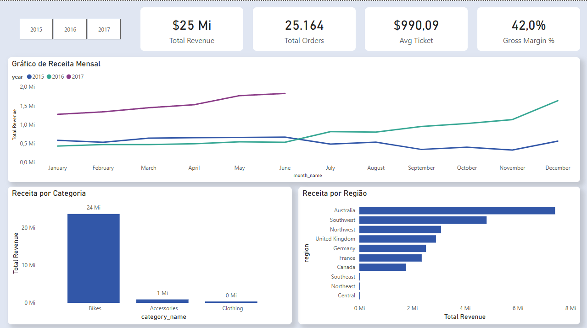
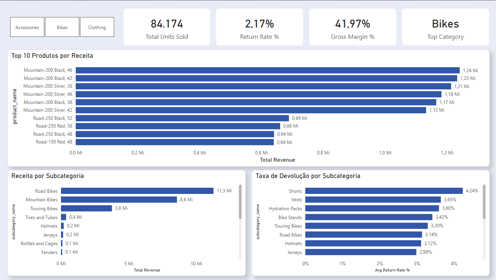
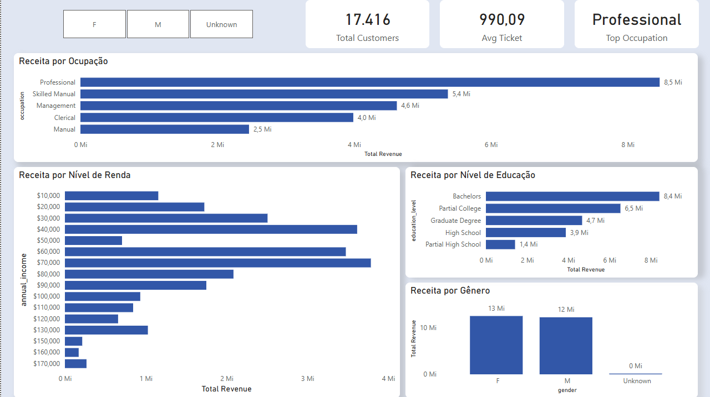

# AdventureWorks Sales Analysis

Dashboard de análise de vendas construído com Python, SQLite e Power BI,
cobrindo o período de janeiro/2015 a junho/2017.

## Contexto de Negócio

A AdventureWorks é uma empresa americana de varejo esportivo especializada
em bicicletas e acessórios, com atuação em mercados da América do Norte,
Europa e Pacífico. Este projeto analisa o desempenho comercial da empresa
com foco em três perguntas de negócio:

1. **A empresa está crescendo? O que está puxando esse crescimento?**
2. **Onde está concentrado o valor do portfólio? Vale diversificar?**
3. **Quem é o cliente mais valioso? Existe concentração de perfil?**

## Principais Insights

**Crescimento consistente, mas dependente de um único produto**
A receita cresceu de $6,4Mi (2015) para $8,8Mi (2016) e já atingiu
$8,5Mi no primeiro semestre de 2017. No entanto, Bikes representam
96% da receita total — Accessories (4%) e Clothing (1%) foram
introduzidos apenas em julho/2016 e ainda têm participação marginal.

**Concentração no Mountain-200**
Os 6 produtos com maior receita são variações do Mountain-200,
representando ~28% do faturamento total. Road Bikes lideram por
subcategoria ($11,3Mi), mas com receita distribuída em mais SKUs.

**Taxa de devolução controlada, com alerta em vestuário**
A taxa média de devolução é 2,17%. Shorts (4,24%) e Vests (3,65%)
lideram as devoluções proporcionalmente — categorias recém-lançadas
que merecem atenção em qualidade ou descrição de produto.

**Perfil de cliente diversificado**
Base de 17 mil clientes sem concentração extrema: equilíbrio entre
gêneros (F: $13Mi / M: $12Mi), com maior receita vinda de
Professionals com ensino superior e faixa de renda entre $40k–$70k.
Clientes de renda muito alta (>$100k) compram menos — produto
aspiracional para classe média, não artigo de luxo.

## Stack Técnica

| Camada | Tecnologia | Decisão |
|---|---|---|
| Extração | Python (Pandas) | Leitura dos CSVs com encoding latin1 |
| Modelagem | SQLite | Star Schema com 2 fatos e 4 dimensões |
| Transformação | SQL (CTEs, Window Functions) | Views para KPIs reutilizáveis |
| Visualização | Power BI Desktop | Modelo relacional com medidas DAX |

## Modelagem — Star Schema

fact_sales ──→ dim_calendar

──→ dim_product   (desnormalizada: Products + Subcategories + Categories)

──→ dim_customer

──→ dim_territory
fact_returns ──→ dim_calendar

──→ dim_product

──→ dim_territory

**Decisões de modelagem documentadas:**
- `dim_product` colapsa 3 tabelas originais em 1 (desnormalização intencional para VertiPaq)
- SCD Tipo 1 aplicado em `dim_customer` — dataset estático sem histórico de mudanças
- `product_price` atual usado como proxy para receita histórica (limitação documentada)
- `income_sort` gerado no ETL para ordenação correta de faixas de renda no Power BI

## Limitações Conhecidas

- Receita calculada como `quantity × product_price` vigente —
  variações históricas de preço não estão refletidas
- 2015 cobre o ano completo mas apenas com categoria Bikes
- 2017 cobre somente janeiro a junho — comparações anuais devem
  ser feitas com cautela
- Coordenadas geográficas não disponíveis — mapa por região textual

## Como Reproduzir

```bash
# 1. Clone o repositório
git clone https://github.com/joao-gabriel-barbara/adventure-works

# 2. Instale as dependências
pip install pandas sqlalchemy

# 3. Execute o ETL
python etl.py

# 4. Exporte para o Power BI
python export_to_csv.py

# 5. Abra adventureworks.pbix no Power BI Desktop
```

## Dashboard




